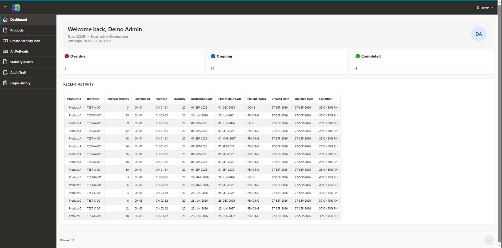
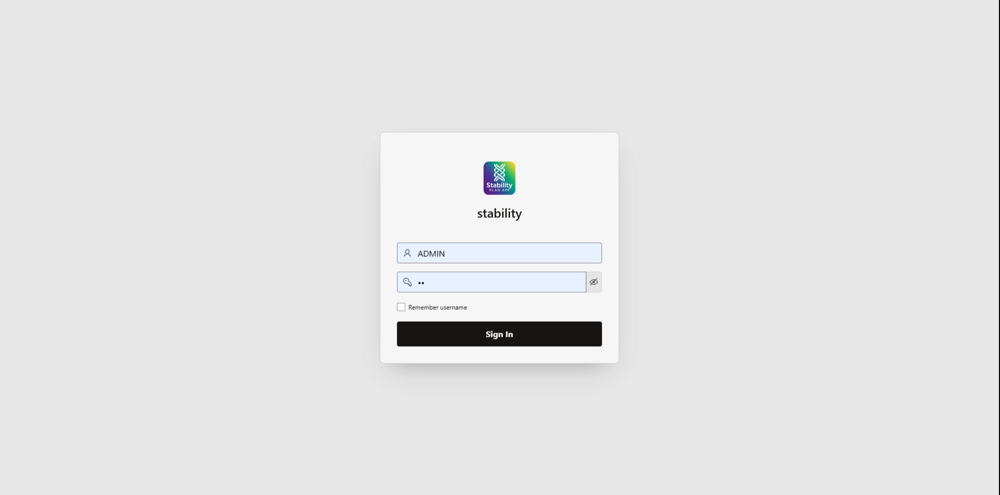
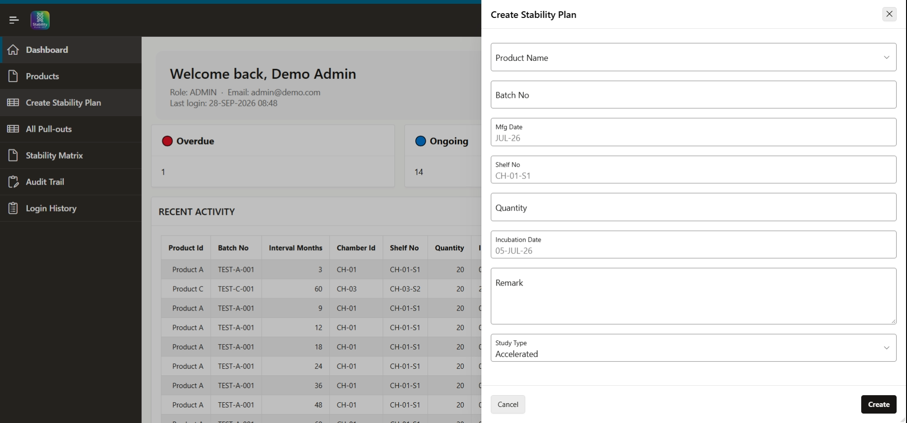
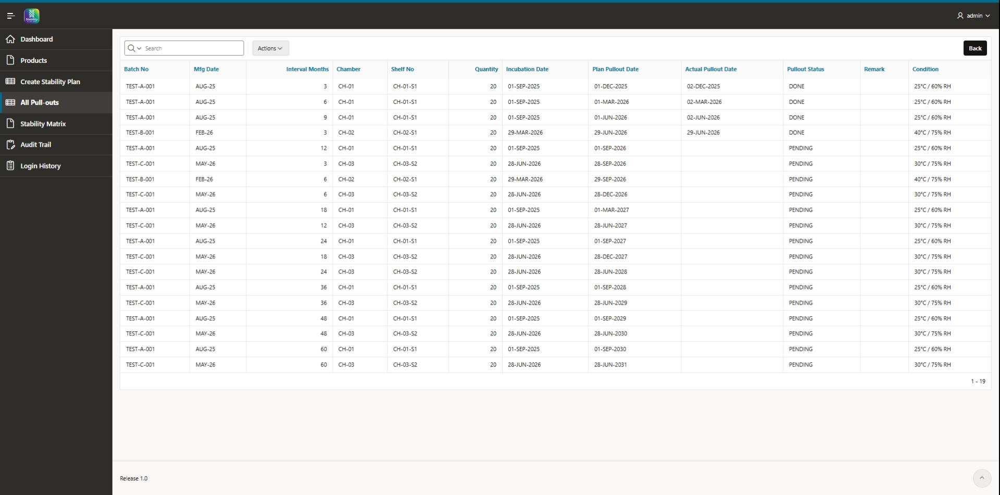
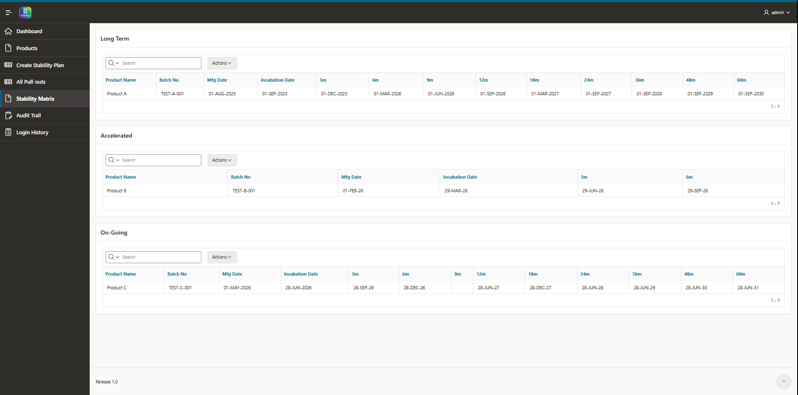
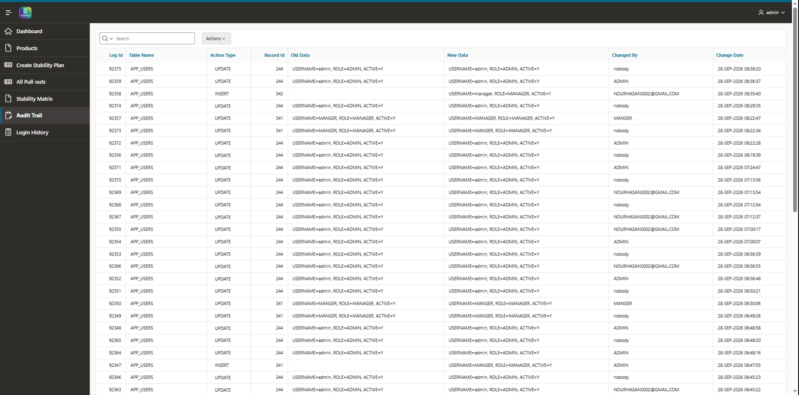
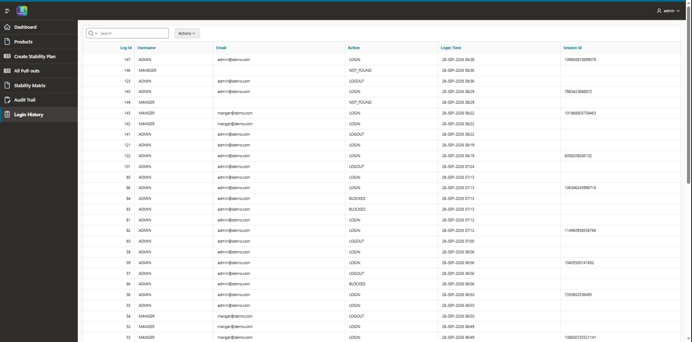

# Stability Tracker

An Oracle APEX application for planning and tracking **pharmaceutical stability study pull-outs**.

Built as a self-training project based on real requirements gathered from a pharmaceutical stability-testing professional. All data in this repository is synthetic.



---

## The Problem

Stability studies require samples to be pulled from climate-controlled chambers at fixed intervals (3, 6, 12... months) over several years. With many products and batches, this means hundreds of scheduled pull-outs. Tracking them manually in spreadsheets is error-prone, and a missed pull-out is a compliance issue.

## The Solution

- **Automatic schedule generation**: choosing a study type (Long-term, Accelerated, Ongoing) generates every pull-out row for the batch
- **Calculated pull-out dates**: planned dates are derived from the incubation date by a database trigger
- **Dashboard** with Overdue / Ongoing / Completed counters
- **Stability matrix**: one row per batch, one column per interval
- **Full audit trail** of changes to users, products, batches and plans
- **Login history** including failed and blocked attempts

---

## Technical Highlights

| Area | Implementation |
|---|---|
| Custom authentication | Password hashing (SHA-256), login audit log, single-session control |
| Business logic | PL/SQL collections to generate study plans by type; unknown types raise an explicit error |
| Database triggers | Auto IDs, pull-out date calculation, actual pull-out stamping, audit logging |
| Reporting | Pivoted stability matrix view (`V_STABILITY_REPORT`) |
| Access control | Role-based authorization schemes |

## Roles

| Role | Access |
|---|---|
| MANAGER | Full access, including user management |
| ADMIN | Full access except user management |
| SUPERVISOR / ANALYST | Read-only |

*Role names follow the original requirements.*

---

## Tech Stack

Oracle APEX 26.1 · PL/SQL · Oracle Database

## Repository Structure

```
stability_schema.sql       Tables, constraints, view, functions, procedures, triggers
stability_sample_data.sql  Synthetic demo data (dates relative to SYSDATE)
stability_app.sql          APEX application export
screenshots/
```

## Installation

1. In APEX, open **SQL Workshop → SQL Scripts**, upload and run `stability_schema.sql`
2. Run `stability_sample_data.sql`
3. Open **App Builder → Import** and import `stability_app.sql`
4. Log in with one of the demo accounts (password `Demo@123`):
   `manager`, `admin`, `supervisor`, `analyst`

---

## Screenshots

| | |
|---|---|
|  |  |
|  |  |
|  |  |

---

## Known Limitations

- Passwords are hashed with unsalted SHA-256; a production version should use a per-user salt
- `STABILITY_WHOLE_PLAN` duplicates some batch attributes (batch number, manufacturing date) instead of relying only on `BATCH_ID`
- Single-session control keeps a user blocked until logout or session timeout if the browser is closed without logging out

## Author

Nour Hasan · [LinkedIn](https://www.linkedin.com/in/nour-hasan-971b6a403)

